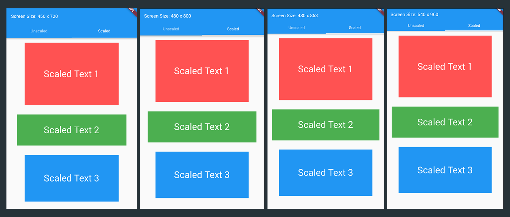
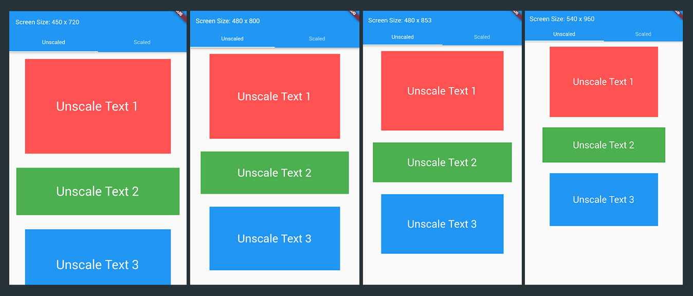

# RelativeScale for Flutter

RelativeScaler is a simple and custom sizing system for flutter widgets to achieve the same physical sizes across different devices.

## Preview

My base screensize when layouting these widgets is `480 x 800`

Now, look at this scaled widgets with _RelativeScale_. There is a difference yeah, but that's because of the system scaled sizes like the AppBar (look at the appbar's height :) ). Now let's forget about that and focus on the texts and the rectangle containers. They are definitely same sizes.


Now, for unscaled sizes, no _RelativeScale_ at all. Well, that's quite obvious :). Look at the texts on the last image, they are very small comparing to the first image. And the rectangle containers, very big difference.

## Usage

It is VERY easy to use.

```Dart
// Usage in Stateful/State
import 'package:flutter/material.dart';
import 'package:relative_scale/relative_scale.dart';


class ScaledExample extends StatefulWidget {
. . .

class _ScaledExampleState extends State<ScaledExample> with RelativeScale {
  @override
  Widget build(BuildContext context) {
    // important: initialize relative scale.
    initRelativeScaler(context);

    return Container(
      // screenHeight and screenWidth is part of the mixin.
      height: screenHeight,
      width: screenWidth,
      child: SingleChildScrollView(
        child: Column(
          children: <Widget>[
            Container(
              height: sy(160),
              width: sy(240),
              margin: EdgeInsets.all(sy(12)),
              color: Colors.redAccent,
              child: Center(
                child: Text(
                  "Scaled Text 1",
                  style: TextStyle(
                    fontSize: sy(24),
                    color: Colors.white,
                  ),
                ),
              ),
            ),
            Container(
              height: sy(80),
              width: sy(280),
              margin: EdgeInsets.all(sy(12)),
              color: Colors.green,
              child: Center(
                child: Text(
                  "Scaled Text 2",
                  style: TextStyle(
                    fontSize: sy(24),
                    color: Colors.white,
                  ),
                ),
              ),
            ),
            Container(
              height: sy(120),
              width: sy(240),
              margin: EdgeInsets.all(sy(12)),
              color: Colors.blue,
              child: Center(
                child: Text(
                  "Scaled Text 3",
                  style: TextStyle(
                    fontSize: sy(24),
                    color: Colors.white,
                  ),
                ),
              ),
            ),
          ],
        ),
      ),
    );
  }
}

```

Full example is in the [Example](https://pub.dev/packages/relative_scale#-example-tab-) section.

Now, this example is implemented in _Stateful->State_ widget. How about _Stateless_ widget?

Well, if you implement it on a stateless widget, you'll get an analyzer warning saying Stateless class is `immutable`. But the `RelativeScaler` mixin's properties are not final so it's mutable.

YOU CAN STILL USE the mixin in Stateless widget and run the app fine without problems actually.
It's just a linter warning but if you don't wanna see it, you can setup a custom analyzer options, like this:

`analysis_options.yaml` :

```yaml
analyzer:
  errors:
    must_be_immutable: ignore
```

This file must be in your project root directory. But please note that we're breaking dart rules here :) It's all on you.

## Scaling Notes

Ok so I'm pretty sure some or most of you is going to use this on existing projects.

For instance you have a container widget like this:

```Dart
Container(
    height: 300,
    width: 500,
)
```

and you implemented RelativeScaler:

```Dart
Container(
    height: sy(300),
    width: sx(500),
)
```

they will not be the same size anymore, using relative scaler will make your sizes a bit bigger. But the hard work will payoff after adjusting your sizes because your app will now have the same widget sizes in every screen size.

Please note that these scaler methods are relative to screen size. So basically in this case `sy(50)` and `sx(50)` is NOT the same size.

ALSO, another thing to note is that if you use `sy` for height and `sx` for width (or vice-versa), you'll get widgets with the same ratio (not size) which is still useful. The _Scaled_ preview image above uses only `sy`, and containers and text has the same size across different screens.

If you want to make a perfect _Square_ container, DON'T do this:

```Dart
Container(
    height: sy(300),
    width: sx(300),
)
// Yeah they are the same value "300", but they are not the same unit 'cause you used "sx" on the width.
```

DO this instead:

```Dart
Container(
    height: sy(300), // or sx(value)
    width: sy(300), // or sx(value)
)
```
